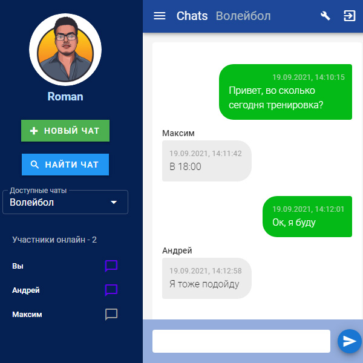
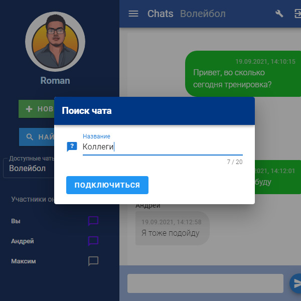
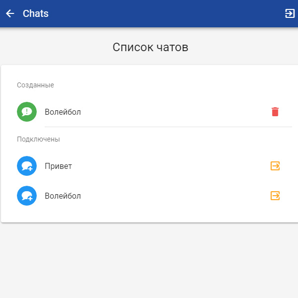
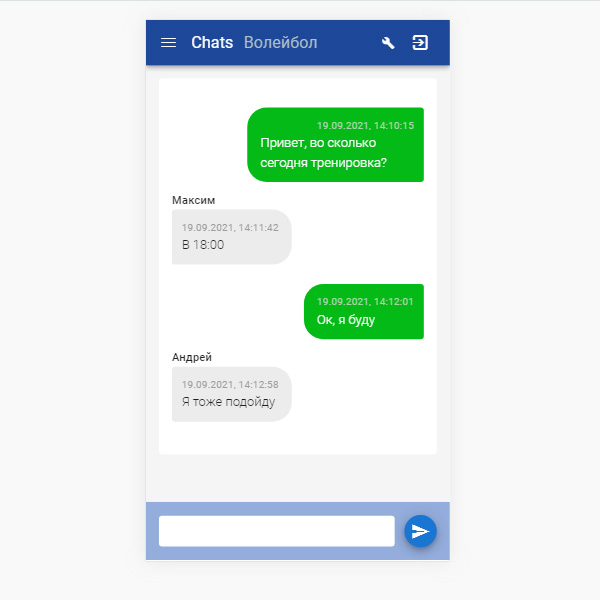
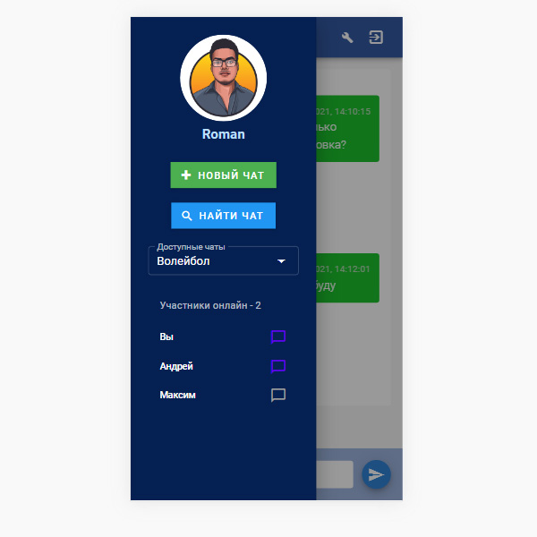

# Chat

Чаты на вебсокетах.

## Стэк

Vue2 + Node + MongoDB

## Как запускать?

1. `npm run install_modules` - установка необходимых пакетов
2. `npm run launch_app_dev` - запуск в режиме разработки

**Для успешного запуска требуются файлы переменных окружения `.env`**

Шаблоны файлов: `/ui/.env.example`, `/api/.env.example`

Приложение работает на следующих портах:
- http://localhost:8080/  – Frontend
- http://localhost:3001/  – Backend

## Принтскрины

<kbd></kbd>

<kbd></kbd>

<kbd></kbd>

<kbd></kbd>

<kbd></kbd>

## Описание проекта

Проект работает с применением Vue Router, Vuex, фреймворка Vuetify на "фронтенде". Входная точка – модуль "Авторизация/Регистрация". Валидация введенных пользователем данных – библиотека Vee-Validate.

На "бэкенде" дополнительно проверяются и валидируются входные данные, пришедшие с форм "фронтенда" ("express-validator"). Роутинг ендпойнтов API реализован посредством фреймворка "Express".

В личном кабинете 2 раздела:
1. Основное поле обмена сообщениями
2. Страница редактирования чатов

### Авторизация

Более детально проработана технология авторизации пользователя и проверки токена при запросах к API с использованием библиотек "jsonwebtoken", "bcryptjs", а также логики генерации refresh-токенов и access-токенов.

С этой целью реализовано:

- Сохранение в базу refresh рефреш-токенов авторизировавшихся пользователей и удаление их при разлогировании.
- Использование на "фронтенде" middleware, отправляющей на сервер в хэдерах AccessToken при каждом запросе, требующем авторизации пользователя (создается отдельный инстанс Axios).
- Использование на "бэкенде" middleware "checkToken", проверяющей токен пользователя при каждом запросе, требующем авторизации.
- На "клиенте" хранится refresh-токен и access-токен. В случае, если access-токен недействителен, сервер по refresh-токену генерирует новый access-токен. Таким образом, можно выставить срок действия refresh-токена, например, месяц, а access-токена – 30 минут. Access-токен будет постоянно обновляться, а пользователю не придется авторизовываться, пока действителен refresh-токен.

### База данных

База данных MongoDB построена по принципам проектирования реляционных баз данных. Для связи таблиц используются ссылки на ObjectId сущностей из других таблиц.

### WebSocket

Посредством вебсокетов отслеживаются не только события об отправке/получении сообщений в чаты, но также и события о входе/выходе участников в чат, об удалении чатов.